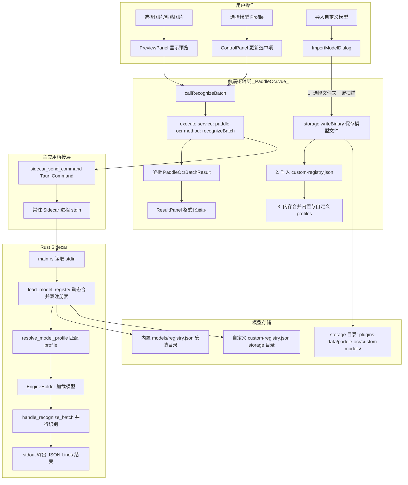

# Paddle OCR 插件界面重构与自定义模型导入 — 技术规格书

> **状态**: Implementing (阶段 1/2 已完成，阶段 3 部分验证中)  
> **创建日期**: 2026-06-30  
> **目标读者**: Codex / Claude Code 等 AI 编码智能体  
> **前置阅读**: [`AGENTS.md`](../../AGENTS.md)、[`ppocrv6-official-migration.md`](./ppocrv6-official-migration.md)
> **施工备注**: `useFileInteraction` 原本不在 `aiohub-sdk` 导出中，本轮已在主应用 SDK 补充导出 `useFileInteraction` / `useImageFileInteraction` / `useSendToChat`，插件侧 `PreviewPanel` 已改为复用 `useImageFileInteraction`。

---

## 目录

1. [背景与现状分析](#1-背景与现状分析)
2. [架构设计](#2-架构设计)
3. [主应用 SDK 接口参考](#3-主应用-sdk-接口参考)
4. [组件接口定义](#4-组件接口定义)
5. [关键实现细节](#5-关键实现细节)
6. [样式规范](#6-样式规范)
7. [与现有代码的兼容性](#7-与现有代码的兼容性)
8. [实施步骤与进度追踪](#8-实施步骤与进度追踪)
9. [验证清单](#9-验证清单)

---

## 1. 背景与现状分析

### 1.1. 当前 [`PaddleOcr.vue`](plugins/aiohub-paddle-ocr/PaddleOcr.vue:1) 的问题

| 问题                  | 描述                                                                                                                       |
| :-------------------- | :------------------------------------------------------------------------------------------------------------------------- |
| **单文件臃肿**        | 523 行全部塞在一个 `.vue` 文件中，模板、逻辑、样式混杂，难以维护                                                           |
| **无图片预览**        | 选择图片后只显示文件名（`selectedTestImageLabel`），用户看不到图片内容                                                     |
| **结果只有 JSON**     | 识别结果通过 `JSON.stringify(lastResult.value, null, 2)` 原样展示在 `<pre>` 中，没有格式化文本、没有复制按钮、没有编辑能力 |
| **不支持自定义模型**  | 模型列表硬编码在 `models/registry.json` 中，用户无法导入自己的模型                                                         |
| **样式简陋**          | 纯色背景、无毛玻璃效果、无响应式折叠面板，与主应用其他工具（如 Smart OCR）的现代风格脱节                                   |
| **静态导入 registry** | `import modelRegistryJson from './models/registry.json'` 是静态导入，运行时修改文件后不会更新                              |

### 1.2. 主应用已具备的能力（可直接利用）

| 能力                          | 来源                                                       | 说明                                                                                                                                           |
| :---------------------------- | :--------------------------------------------------------- | :--------------------------------------------------------------------------------------------------------------------------------------------- |
| **插件专属数据目录**          | `src-tauri/src/commands/sidecar_plugin_manager.rs:230-244` | 启动 sidecar 时注入环境变量 `AIOHUB_PLUGIN_DATA_DIR`，指向 `appConfigDir/plugins-data/paddle-ocr/`                                             |
| **Storage API**               | `src/services/plugin-manager.ts:369-453`                   | `PluginContext.storage` 提供 `getDataDir()`、`readText()`、`writeText()`、`readBinary()`、`writeBinary()`、`exists()`、`remove()`、`readDir()` |
| **PluginContext**             | `src/services/plugin-manager.ts:459-498`                   | 通过 `pluginManager.createPluginContext(pluginId)` 获取，包含 `storage`、`settings`、`environment`、`chat`                                     |
| **aiohub-sdk**                | `src/services/plugin-sdk.ts`                               | 插件可导入 `pluginManager`、`execute`、`customMessage`、`createModuleLogger`、`createModuleErrorHandler`、`useSendToChat` 等                   |
| **pluginManager.getPlugin()** | `src/services/plugin-manager.ts:777-787`                   | 可获取插件代理对象，包含 `installPath` 属性                                                                                                    |

---

## 2. 架构设计

### 2.1. 数据流图 (双注册表动态合并方案)

> **核心修正**: 生产环境下安装目录（`installPath`）通常是只读的（如 `C:\Program Files`），且插件更新时会被全量覆盖。因此，**绝对禁止写回安装目录的 `registry.json`**。
>
> 采用 **双注册表动态合并** 方案：前端与后端 sidecar 独立读取内置 `registry.json` 与 `storage` 目录下的 `custom-registry.json`，并在内存中进行合并。



### 2.2. 组件树

```
PaddleOcr.vue (主入口，背景设为 transparent 以呈现毛玻璃通透感)
├── ControlPanel.vue (毛玻璃面板)
│   ├── 状态指标卡片 (运行时状态、后端类型、耗时)
│   ├── 模型选择下拉框 (el-select)
│   ├── "导入自定义模型" 按钮 → 打开 ImportModelDialog
│   ├── "选择图片" 按钮
│   ├── "检查运行时" 按钮
│   └── "开始识别" 按钮
├── PreviewPanel.vue (自适应宽度，毛玻璃面板)
│   ├── 拖拽/粘贴上传区域 (复用 useFileInteraction)
│   ├── 图片预览 (img 标签)
│   └── 文本框叠加层 (根据 ocrLines 坐标 bbox 动态绘制半透明文本框)
└── ResultPanel.vue (毛玻璃面板)
    ├── 工具栏 (复制全部、发送到聊天、查看原始 JSON)
    ├── 格式化文本列表 (按图片分组、按块折叠)
    │   ├── 单行文本展示
    │   ├── 置信度显示
    │   ├── 单行复制按钮
    │   └── 单行编辑按钮 (双击或点击编辑图标，使用本地自治状态，不污染 Prop)
    └── 原始 JSON 折叠面板 (el-collapse)
```

### 2.3. 状态管理方案

由于插件 UI 是独立 Vue 组件（非 Pinia Store），状态管理采用 **Composition API + reactive/ref** 在 [`PaddleOcr.vue`](plugins/aiohub-paddle-ocr/PaddleOcr.vue:94) 中集中管理，通过 Props/Emits 向子组件传递：

```
PaddleOcr.vue (状态所有者)
├── runtimeStatus: ref<'idle' | 'ready' | 'error'>
├── modelStatus: ref<'unknown' | 'ready' | 'missing'>
├── selectedProfileId: ref<string>
├── modelProfiles: ref<ModelRegistryProfile[]>  ← 动态从双注册表合并加载
├── selectedTestImage: ref<{ name: string; dataUrl: string } | null>
├── lastResult: ref<PaddleOcrBatchResult | null>
├── lastDurationMs: ref<number | null>
├── isProcessing: ref<boolean>
│
├── 方法:
│   ├── loadRegistry() → 动态读取并合并内置与自定义注册表
│   ├── importCustomModel(formData) → 保存模型文件到 storage 并更新 custom-registry.json
│   ├── callRecognizeBatch(images) → 调用 sidecar
│   ├── checkRuntime() → 空 batch 检查
│   └── runOcr() → 对选中图片执行识别
│
└── 子组件通过 Props 接收状态，通过 Emits 通知父组件
```

---

## 3. 主应用 SDK 接口参考

### 3.1. 获取 PluginContext 和 Storage API

```typescript
// 在 PaddleOcr.vue 的 <script setup> 中
import { pluginManager } from "aiohub-sdk";

// 获取插件上下文（包含 storage、settings、environment、chat）
const pluginContext = pluginManager.createPluginContext("paddle-ocr");

// Storage API 完整签名:
interface PluginStorageAPI {
  getDataDir(): Promise<string>; // 获取插件数据根目录
  readText(path: string): Promise<string>; // 读取文本文件
  readBinary(path: string): Promise<Uint8Array>; // 读取二进制文件
  writeText(path: string, data: string): Promise<void>; // 写入文本文件
  writeBinary(path: string, data: Uint8Array | ArrayBuffer): Promise<void>; // 写入二进制文件
  exists(path: string): Promise<boolean>; // 检查文件/目录是否存在
  remove(path: string): Promise<void>; // 删除文件或目录（递归）
  readDir(path: string): Promise<Array<{ name: string; isDirectory: boolean }>>; // 列出目录内容
}
```

### 3.2. 获取插件安装目录

```typescript
// 通过 pluginManager 获取插件代理对象
const plugin = pluginManager.getPlugin("paddle-ocr");
const installPath = plugin?.installPath; // 开发模式: "plugins/aiohub-paddle-ocr"
// 生产模式: 绝对路径如 "C:/Users/.../appData/.../plugins/paddle-ocr"
```

### 3.3. 调用 OCR 识别

```typescript
import { execute } from "aiohub-sdk";

// 调用 recognizeBatch 方法
const result = (await execute({
  service: "paddle-ocr",
  method: "recognizeBatch",
  params: {
    images: [
      {
        blockId: "block-1",
        imageId: "image-1",
        dataUrl: "data:image/png;base64,...",
      },
    ],
    options: {
      modelProfile: "ppocr-v5-mobile-general", // 可选，指定模型 profile
    },
  },
})) as PaddleOcrBatchResult;

// 返回类型:
interface PaddleOcrBatchResult {
  results: PaddleOcrImageResult[];
}

interface PaddleOcrImageResult {
  blockId: string;
  imageId: string;
  text: string;
  confidence?: number;
  status: "success" | "error";
  error?: string;
  lines?: OcrLine[]; // 包含坐标信息
}

interface OcrLine {
  text: string;
  score: number;
  bbox: number[][]; // 四点坐标 [[x1, y1], [x2, y2], [x3, y3], [x4, y4]]
}
```

---

## 4. 组件接口定义

### 4.1. [`PaddleOcr.vue`](plugins/aiohub-paddle-ocr/PaddleOcr.vue:1)（主入口）

**职责**: 状态管理中心，协调所有子组件，处理 OCR 调用逻辑。

**不对外暴露 Props**（它是根组件）。

### 4.2. `ControlPanel.vue`

**职责**: 展示运行时状态卡片、模型选择、操作按钮。

```typescript
// Props
interface ControlPanelProps {
  runtimeStatus: "idle" | "ready" | "error";
  modelStatus: "unknown" | "ready" | "missing";
  isProcessing: boolean;
  lastDurationMs: number | null;
  selectedProfileId: string;
  modelProfiles: ModelRegistryProfile[];
  selectedImageName: string | null; // 当前选中图片的文件名
  version: string;
}

// Emits
interface ControlPanelEmits {
  "update:selectedProfileId": [profileId: string];
  "select-image": []; // 点击"选择图片"按钮
  "check-runtime": []; // 点击"检查运行时"按钮
  "run-ocr": []; // 点击"开始识别"按钮
  "import-model": []; // 点击"导入自定义模型"按钮
}
```

### 4.3. `PreviewPanel.vue`

**职责**: 图片拖拽/粘贴上传、图片预览、文本框叠加绘制。

```typescript
// Props
interface PreviewPanelProps {
  selectedImage: { name: string; dataUrl: string } | null;
  isProcessing: boolean;
  ocrLines?: OcrLine[]; // 识别出的文本行坐标（用于叠加文本框）
}

// Emits
interface PreviewPanelEmits {
  "image-selected": [file: File]; // 用户选择了新图片
  "image-cleared": []; // 用户清除了图片
}
```

### 4.4. `ResultPanel.vue`

**职责**: 格式化展示识别结果，提供复制、发送到聊天、编辑等操作。

```typescript
// Props
interface ResultPanelProps {
  result: PaddleOcrBatchResult | null;
  isProcessing: boolean;
  selectedImageName: string | null;
}
```

### 4.5. `ImportModelDialog.vue`

**职责**: 引导用户导入自定义模型。支持**选择文件夹一键扫描**与手动微调。

```typescript
// Props
interface ImportModelDialogProps {
  visible: boolean;
}

// Emits
interface ImportModelDialogEmits {
  "update:visible": [visible: boolean];
  imported: [profile: ModelRegistryProfile]; // 导入成功后通知父组件刷新列表
}

// 内部表单数据
interface ImportModelForm {
  modelName: string;
  backend: "mnn-ocr-rs" | "onnxruntime";
  language: string;
  modelDir: string; // 选中的本地文件夹绝对路径
  // 扫描出的文件列表（用于展示和微调）
  detModel?: string;
  recModel?: string;
  dict?: string;
  detOnnx?: string;
  recOnnx?: string;
  detConfig?: string;
  recConfig?: string;
}
```

---

## 5. 关键实现细节

### 5.1. 动态读取与合并双注册表（前端）

前端在初始化和导入成功后，动态读取内置 `registry.json` 与 `storage` 中的 `custom-registry.json` 并合并：

```typescript
import { pluginManager } from "aiohub-sdk";

const modelProfiles = ref<ModelRegistryProfile[]>([]);

async function loadRegistry(): Promise<void> {
  const plugin = pluginManager.getPlugin("paddle-ocr");
  const installPath = plugin?.installPath;
  if (!installPath) return;

  const { join } = await import("@tauri-apps/api/path");
  const fs = await import("@tauri-apps/plugin-fs");

  // 1. 读取内置注册表
  const registryPath = await join(installPath, "models", "registry.json");
  let builtInProfiles: ModelRegistryProfile[] = [];
  try {
    const content = await fs.readTextFile(registryPath);
    const registry = JSON.parse(content) as ModelRegistry;
    builtInProfiles = registry.profiles;
  } catch (e) {
    console.error("读取内置注册表失败", e);
  }

  // 2. 读取自定义注册表
  let customProfiles: ModelRegistryProfile[] = [];
  const storage = pluginContext.storage;
  try {
    if (await storage.exists("custom-registry.json")) {
      const content = await storage.readText("custom-registry.json");
      const customRegistry = JSON.parse(content) as ModelRegistry;
      customProfiles = customRegistry.profiles;
    }
  } catch (e) {
    console.error("读取自定义注册表失败", e);
  }

  // 3. 合并去重
  const merged = [...builtInProfiles];
  const existingIds = new Set(merged.map((p) => p.id));
  for (const p of customProfiles) {
    if (!existingIds.has(p.id)) {
      merged.push(p);
    }
  }

  modelProfiles.value = merged;
}
```

### 5.2. 文件夹一键扫描导入流程

使用 `@tauri-apps/plugin-dialog` 选择文件夹，并自动扫描匹配模型文件：

```typescript
import { open } from "@tauri-apps/plugin-dialog";
import { readDir } from "@tauri-apps/plugin-fs";

async function handleSelectFolder() {
  const selected = await open({
    directory: true,
    multiple: false,
    title: "选择包含 Paddle OCR 模型的文件夹",
  });

  if (!selected || typeof selected !== "string") return;

  form.modelDir = selected;

  // 扫描文件夹内容
  const entries = await readDir(selected);
  const files = entries.filter((e) => !e.isDirectory).map((e) => e.name);

  // 自动匹配文件
  if (form.backend === "mnn-ocr-rs") {
    form.detModel = files.find(
      (f) => f.endsWith(".mnn") && f.toLowerCase().includes("det")
    );
    form.recModel = files.find(
      (f) => f.endsWith(".mnn") && f.toLowerCase().includes("rec")
    );
    form.dict = files.find(
      (f) => f.endsWith(".txt") || f.toLowerCase().includes("dict")
    );
  } else {
    form.detOnnx = files.find(
      (f) => f.endsWith(".onnx") && f.toLowerCase().includes("det")
    );
    form.recOnnx = files.find(
      (f) => f.endsWith(".onnx") && f.toLowerCase().includes("rec")
    );
    form.detConfig = files.find(
      (f) => f.endsWith(".yml") && f.toLowerCase().includes("det")
    );
    form.recConfig = files.find(
      (f) => f.endsWith(".yml") && f.toLowerCase().includes("rec")
    );
    form.dict = files.find(
      (f) => f.endsWith(".txt") || f.toLowerCase().includes("dict")
    );
  }
}
```

导入时，将选中的模型文件夹拷贝到 `storage` 目录，并写入 `custom-registry.json`：

```typescript
async function importCustomModel(formData: ImportModelForm): Promise<void> {
  const storage = pluginContext.storage;
  const modelId = `custom-${Date.now()}-${formData.modelName.replace(/\s+/g, "-").toLowerCase()}`;
  const targetModelDir = `custom-models/${modelId}`;

  // 1. 拷贝选中的模型文件到 storage 目录
  const { join } = await import("@tauri-apps/api/path");
  const fs = await import("@tauri-apps/plugin-fs");

  const filesToCopy =
    formData.backend === "mnn-ocr-rs"
      ? [formData.detModel, formData.recModel, formData.dict]
      : [
          formData.detOnnx,
          formData.recOnnx,
          formData.detConfig,
          formData.recConfig,
          formData.dict,
        ];

  for (const file of filesToCopy) {
    if (!file) continue;
    const srcPath = await join(formData.modelDir, file);
    const destPath = `${targetModelDir}/${file}`;

    // 读取并写入到 storage
    const data = await fs.readFile(srcPath);
    await storage.writeBinary(destPath, data);
  }

  // 2. 获取 storage 目录的绝对路径
  const dataDir = await storage.getDataDir();
  const absoluteModelDir = `${dataDir}/${targetModelDir}`.replace(/\\/g, "/");

  // 3. 构建自定义 profile
  const customProfile: ModelRegistryProfile = {
    id: modelId,
    name: formData.modelName,
    backend: formData.backend,
    language: formData.language,
    modelDir: absoluteModelDir,
    detModel: formData.detModel,
    recModel: formData.recModel,
    detOnnx: formData.detOnnx,
    recOnnx: formData.recOnnx,
    detConfig: formData.detConfig,
    recConfig: formData.recConfig,
    dict: formData.dict,
    builtIn: false,
    package: false,
    experimental: false,
  };

  // 4. 更新 custom-registry.json
  let customRegistry: ModelRegistry = {
    schemaVersion: 1,
    defaultProfile: "",
    profiles: [],
  };
  if (await storage.exists("custom-registry.json")) {
    const content = await storage.readText("custom-registry.json");
    customRegistry = JSON.parse(content);
  }
  customRegistry.profiles.push(customProfile);
  await storage.writeText(
    "custom-registry.json",
    JSON.stringify(customRegistry, null, 2)
  );

  // 5. 刷新前端注册表
  await loadRegistry();

  customMessage.success(`自定义模型 "${formData.modelName}" 导入成功`);
}
```

### 5.3. 后端 Sidecar 动态合并双注册表（Rust）

修改 [`model_registry.rs`](plugins/aiohub-paddle-ocr/src/model_registry.rs:115) 中的 [`load_model_registry()`](plugins/aiohub-paddle-ocr/src/model_registry.rs:115) 函数，使其在启动时自动合并 `AIOHUB_PLUGIN_DATA_DIR` 下的 `custom-registry.json`：

```rust
pub(crate) fn load_model_registry() -> Result<ModelRegistry, SidecarError> {
    // 1. 读取内置注册表
    let registry_path = Path::new(MODEL_ROOT).join(MODEL_REGISTRY_FILE);
    let content = fs::read_to_string(&registry_path).map_err(|error| {
        SidecarError::InvalidModelRegistry(format!("读取 {} 失败: {}", registry_path.display(), error))
    })?;
    let mut registry: ModelRegistry = serde_json::from_str(&content).map_err(|error| {
        SidecarError::InvalidModelRegistry(format!("解析 {} 失败: {}", registry_path.display(), error))
    })?;

    // 2. 尝试读取自定义注册表并合并
    if let Ok(data_dir_str) = std::env::var("AIOHUB_PLUGIN_DATA_DIR") {
        let custom_registry_path = Path::new(&data_dir_str).join("custom-registry.json");
        if custom_registry_path.is_file() {
            if let Ok(custom_content) = fs::read_to_string(&custom_registry_path) {
                if let Ok(custom_registry) = serde_json::from_str::<ModelRegistry>(&custom_content) {
                    // 合并 profiles
                    for custom_profile in custom_registry.profiles {
                        if !registry.profiles.iter().any(|p| p.id == custom_profile.id) {
                            registry.profiles.push(custom_profile);
                        }
                    }
                }
            }
        }
    }

    validate_model_registry(&registry)?;
    Ok(registry)
}
```

### 5.4. ResultPanel 本地自治编辑状态

在 `ResultPanel.vue` 中，使用本地 `reactive` 状态存储用户的临时编辑，避免直接修改 Prop：

```typescript
// ResultPanel.vue
const props = defineProps<{
  result: PaddleOcrBatchResult | null;
}>();

// 本地编辑状态映射: Record<"imageId-lineIndex", editedText>
const editedTexts = reactive<Record<string, string>>({});
const editingKey = ref<string | null>(null);
const editingValue = ref("");

function getLineText(
  imageId: string,
  lineIndex: number,
  originalText: string
): string {
  const key = `${imageId}-${lineIndex}`;
  return editedTexts[key] !== undefined ? editedTexts[key] : originalText;
}

function startEdit(imageId: string, lineIndex: number, originalText: string) {
  editingKey.value = `${imageId}-${lineIndex}`;
  editingValue.value = getLineText(imageId, lineIndex, originalText);
}

function saveEdit() {
  if (editingKey.value) {
    editedTexts[editingKey.value] = editingValue.value;
    editingKey.value = null;
  }
}
```

---

## 6. 样式规范

### 6.1. 主题变量与毛玻璃效果

主容器 [`PaddleOcr.vue`](plugins/aiohub-paddle-ocr/PaddleOcr.vue:341) 背景设为 `transparent`，而内部的 `ControlPanel`、`PreviewPanel`、`ResultPanel` 使用 `var(--card-bg)` 并附加毛玻璃模糊，以呈现完美的通透感：

```css
/* 主容器 */
.paddle-ocr {
  display: flex;
  gap: 16px;
  height: 100%;
  padding: 16px;
  background: transparent; /* 关键：背景透明 */
  overflow: hidden;
}

/* 子面板通用样式 */
.glass-panel {
  background-color: var(--card-bg);
  backdrop-filter: blur(var(--ui-blur));
  border: var(--border-width) solid var(--border-color);
  border-radius: 8px;
  padding: 16px;
  display: flex;
  flex-direction: column;
  overflow: hidden;
}
```

### 6.2. 响应式三栏布局

参考 `src/tools/smart-ocr/SmartOcr.vue` 的三栏式布局：

- 左栏（ControlPanel）：固定宽度 320px
- 中栏（PreviewPanel）：`flex: 1`，自适应，支持图片预览与文本框叠加
- 右栏（ResultPanel）：固定宽度 400px
- 窄屏下（`max-width: 1024px`）自动切换为单列滚动布局。

---

## 7. 与现有代码的兼容性

### 7.1. 保留的逻辑

| 逻辑                    | 位置（旧）              | 位置（新）                            |
| :---------------------- | :---------------------- | :------------------------------------ |
| `callRecognizeBatch`    | `PaddleOcr.vue:220-237` | `PaddleOcr.vue`（保留，增强错误处理） |
| `readFileAsDataUrl`     | `PaddleOcr.vue:253-264` | `PaddleOcr.vue`（保留）               |
| `checkRuntime`          | `PaddleOcr.vue:294-307` | `ControlPanel.vue` 通过 emit 触发     |
| `runSmokeTest`          | `PaddleOcr.vue:309-338` | 重命名为 `runOcr`，逻辑保留           |
| `updateStatusFromError` | `PaddleOcr.vue:239-251` | `PaddleOcr.vue`（保留）               |

### 7.2. 废弃的逻辑

| 逻辑                                                     | 原因                         |
| :------------------------------------------------------- | :--------------------------- |
| `import modelRegistryJson from './models/registry.json'` | 改为动态读取与双注册表合并   |
| `modelFiles` computed                                    | 不再需要在 UI 中列出模型文件 |
| 模型文件列表 `<ul class="file-list">`                    | 移除，简化界面               |
| 模型来源 `<dl class="meta-list">`                        | 移除，简化界面               |

---

## 8. 实施步骤与进度追踪

### 阶段 1：创建子组件与基础布局

- [x] **1.1** 创建 `plugins/aiohub-paddle-ocr/components/` 目录
- [x] **1.2** 实现 `ImportModelDialog.vue`
  - 使用 `BaseDialog` 作为容器（当前主应用 `BaseDialog` 未暴露 `lockScroll` prop）
  - 支持 SDK 导出的 `openDialog` 文件夹一键扫描与自动匹配
- [x] **1.3** 实现 `ControlPanel.vue`
  - 状态指标卡片（4 列 grid）：运行时状态、模型状态、后端类型、最近耗时
  - 模型选择下拉框（`el-select`），选项从 `modelProfiles` prop 动态渲染
- [x] **1.4** 实现 `PreviewPanel.vue`
  - 拖拽与粘贴上传区域：复用 `useFileInteraction`
  - 图片预览与 `ocrLines` 文本框叠加绘制
- [x] **1.5** 实现 `ResultPanel.vue`
  - 工具栏：复制全部、发送到聊天、查看原始 JSON
  - 格式化文本列表：按图片分组，支持单行本地自治编辑
- [x] **1.6** 重构 `PaddleOcr.vue`
  - 搭建三栏毛玻璃布局，引入子组件并连接状态

### 阶段 2：实现后端 Sidecar 双注册表合并

- [x] **2.1** 修改 [`model_registry.rs`](plugins/aiohub-paddle-ocr/src/model_registry.rs:115) 中的 [`load_model_registry()`](plugins/aiohub-paddle-ocr/src/model_registry.rs:115)
- [x] **2.2** 运行 `bun run build:rust` 编译 sidecar
- [x] **2.3** 独立启动 sidecar，通过 stdin 输入测试自定义 profile 加载

### 阶段 3：联调与验证

- [ ] **3.1** 联调自定义模型导入与动态合并
- [ ] **3.2** 验证生产环境只读路径下的鲁棒性
- [x] **3.3** 运行 `bun run build:vue` 确保编译通过

---

## 9. 验证清单

- [x] `bun run build:vue` Vite 打包通过
- [ ] 导入自定义模型时，文件被正确拷贝到 `storage` 目录，且 `custom-registry.json` 被正确更新
- [ ] 生产环境下导入自定义模型无权限报错，重启插件后自定义模型仍然存在
- [x] 选择自定义模型后，OCR 识别正常执行（已通过模拟 `AIOHUB_PLUGIN_DATA_DIR/custom-registry.json` + sidecar 空 batch 验证 profile 可加载；真实图片识别待联调）
- [ ] 粘贴剪贴板图片能正常触发识别（组件已接入 `useImageFileInteraction`，待真实 Tauri UI 验证）
- [x] 识别结果支持单行编辑，且编辑后复制全部/发送到聊天内容同步更新
- [ ] 响应式布局：窄屏下布局自动切换为单列
- [ ] 主题切换：明/暗主题下界面颜色正确，毛玻璃通透度良好

### 9.1. 当前验证记录

- `bun run build:vue`: 通过。
- `bun run build:rust`: 通过。
- 主应用根目录 `bun run build:tsc`: 通过，确认新增 SDK 导出未破坏宿主类型构建。
- 独立 sidecar 内置 profile 空 batch: 通过，返回 `{"results":[]}`。
- 独立 sidecar 自定义 profile 模拟加载: 通过，可从 `AIOHUB_PLUGIN_DATA_DIR/custom-registry.json` 合并并选中 `custom-check-profile`。
- 插件目录 `bun x vue-tsc -p tsconfig.json --noEmit`: 未通过，错误来自插件 tsconfig 解析主应用 `../../src` SDK 源码后触发的别名/worker/第三方类型解析问题；主应用自己的 `build:tsc` 已通过。
